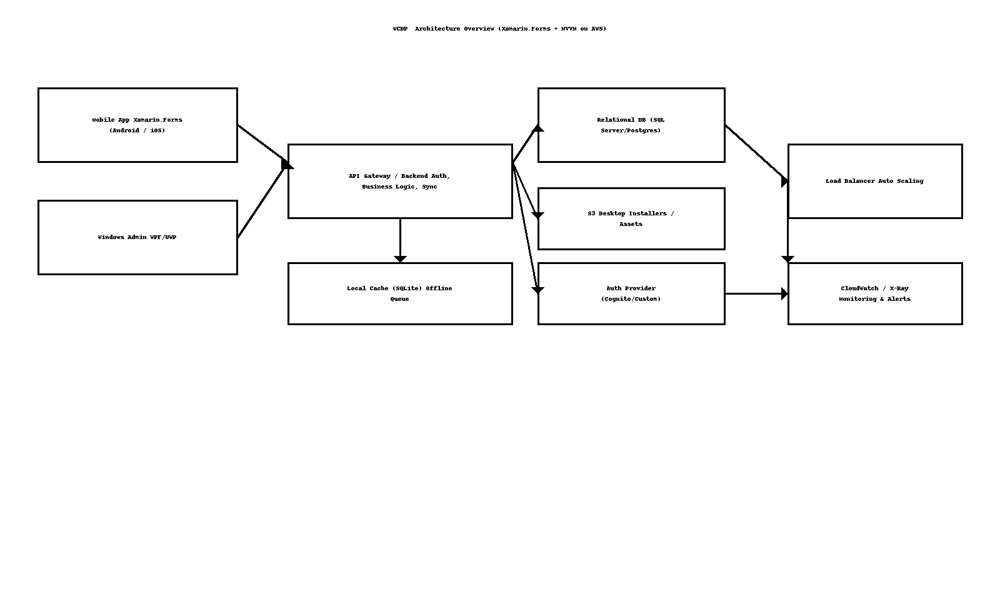

# WCDP – High-Level Design (HLD)

> **Client:** Dry Wall, West Coast, California, USA  
> **Author:** Sagarika Chakraborty — Full Stack .NET Engineer | React.js | Web API | SQL Server

## 1. Overview & Scope
**WCDP** provides a **mobile app** for field employees (Android/iOS) and a **Windows desktop app** for administrators to manage time tracking, attendance, and task assignments. Built with **Xamarin.Forms** and **MVVM**, WCDP integrates with secure backend APIs and supports **offline-first** usage with synchronization. **AWS** hosts the backend and CI/CD.

## 2. Goals & NFRs
- **Usability**: Consistent cross-platform UX with reusable XAML styles/themes.
- **Reliability**: Offline cache with conflict resolution; idempotent sync.
- **Performance**: Fast page loads; background sync; pagination for history.
- **Security**: JWT/OAuth, TLS, secure storage for tokens; least-privilege IAM.
- **Scalability**: Auto-scaling and load balancing for peak workforce hours.
- **Observability**: Centralized logs/metrics; crash analytics for mobile; APM for APIs.

## 3. Architecture


```mermaid
flowchart LR
  A[Mobile App (Xamarin.Forms)] -->|JWT| C[API Gateway/Backend]
  B[Windows Admin App] -->|JWT| C[API Gateway/Backend]
  A --> D[Local Cache (SQLite)]
  C --> E[(DB: SQL Server/Postgres)]
  C --> F[S3 (Installers/Assets)]
  C --> G[Auth Provider (Cognito/Custom)]
  C --> H[CloudWatch / X-Ray]
  C --> I[Load Balancer + Auto Scaling]
```

## 4. Components
- **Mobile App (Xamarin.Forms)**: Punch in/out, attendance, tasks; offline cache + background sync.
- **Windows Admin App**: Assign tasks, monitor attendance/timecards, generate reports.
- **Backend API**: AuthN/Z, business logic, sync endpoints, reporting.
- **Data Store**: Relational DB for authoritative data; **SQLite** on-device cache.
- **CI/CD**: AWS CodePipeline/CodeBuild; automatic builds and releases to stores and S3.
- **Security**: OAuth/JWT tokens; HTTPS; IAM roles; parameter store/Secrets Manager.

## 5. User Journeys (Happy Paths)
1. **Employee Punch** → mobile app records punch (offline if necessary) → syncs to API → timecard updated.
2. **Attendance Report** → admin desktop queries API → aggregated results shown/exported.
3. **Task Assignment** → admin creates tasks → employees receive & update status → analytics reflect progress.

## 6. Availability & DR
- Multi-AZ backend; auto-scaling; daily automated backups.
- Blue/green or rolling deployments; health checks and alarms.

## 7. CI/CD & Distribution
- CodePipeline triggers on commit → CodeBuild runs tests → artifacts published.
- Mobile packages delivered to **Play Store**/**App Store**; desktop installer to **S3/CloudFront**.
- IAM policies restrict build & deploy permissions.

## 8. Assumptions
- Backend provides REST endpoints; push notifications optional (SNS/Firebase/APNS).
- MDM/Intune may be used for enterprise distribution (optional).
